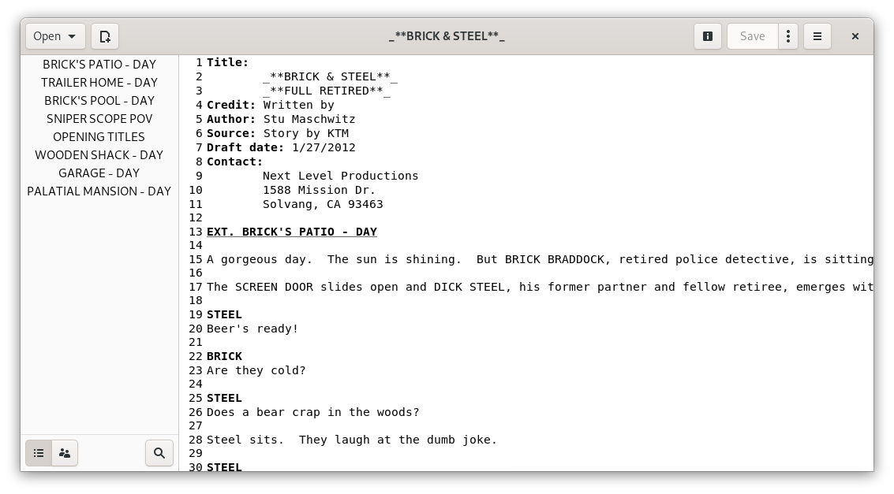

<h1 align="center">
	 
 Stories Typer
</h1>

<strong>Screenwriting software for GNOME</strong>

# ADVICES
THIS IS PROOF OF CONCEPT SOFTWARE FAR FROM USABLE.

PLEASE DON'T OPEN ISSUES FOR THINGS WE ALL KNOW ARE BROKEN.

CURRENT CODE IS SHITTY AND DIRTY.

## Installation
This app is written to be Flatpak only. The easiest way to test **Stories Typer** is cloning this repo with **GNOME Builder** and run it from there.

